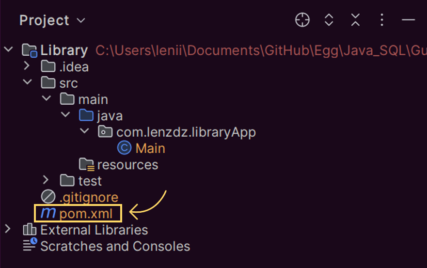
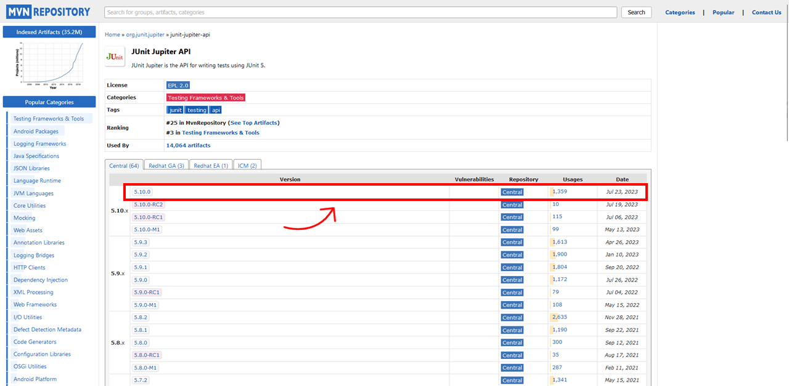
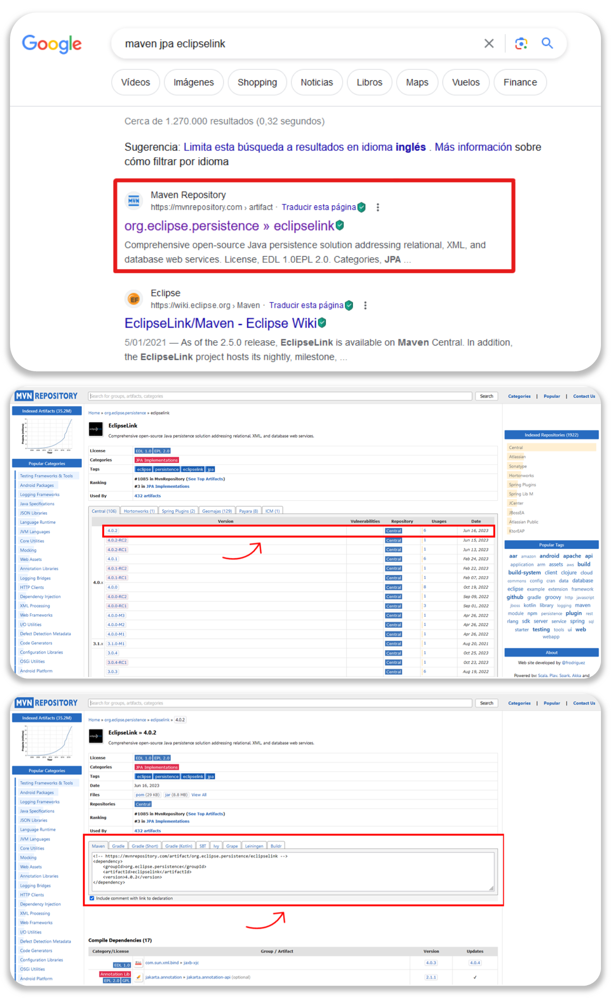

# Tutorial Conexión JPA en IntelliJ Idea Community Editions

En este tutorial revisaremos cómo establecer una **conexión con una base de datos desde IntelliJ Idea Community Editions haciendo uso de Maven, el driver JDBC de MySQL y la implementación ofrecida por EclipseLink de JPA** (API de persistencia de Java, por sus siglas en inglés). Actualmente no hay casi información acerca de cómo realizar este proceso manualmente en la versión gratuita del IDE previamente mencionado, por lo que espero que este documento sea de ayuda para quienes lo necesiten.

## Creando nuestro proyecto

En primer lugar, tendremos que crear nuestro proyecto. Para ello iremos a File > New > Project (véase la figura 1), si tenemos abierto ya un proyecto, o a New Project (véase la figura 2), si estamos en la página de inicio de IntelliJ Idea.

<p align="center">
  <br>
  <strong>Figura 1.</strong> Creación de proyecto en IntelliJ Idea Community Edition cuando se tiene abierto otro proyecto.
</p>

<p align="center">
  <br>
  <strong>Figura 2.</strong> Creación de proyecto en IntelliJ Idea Community Edition cuando se está en la página de inicio.
</p>

En la ventana emergente, asignaremos un nombre a nuestro proyecto y escogeremos la ruta en la que lo guardaremos. Posteriormente, elegiremos «Java» como lenguaje (*language*), «Maven» como herramienta de construcción (*build system*) y seleccionaremos la versión 17 de Java (véase la figura 3). En las opciones avanzadas, podremos también asignar un valor al identificador del equipo (*groupId*),  elemento que señala la organización o grupo que creó el proyecto. La estructura que debe seguir este ítem es: «com.[nombre del responsable del proyecto].[nombre del proyecto]». En este caso, utilizaré mi nombre de usuario de Github para el nombre del responsable, así que quedará de la siguiente manera: com.lenzdz.libraryApp. No es necesario que modifiquemos el identificar del artefacto (*artifactId*), que vendría siendo el mismo nombre del proyecto. Una vez hayamos terminado, haremos clic en el botón «Create».

<p align="center">
  <br>
  <strong>Figura 3.</strong> Selección de opciones en menú de creación de proyecto.
</p>

## Añadiendo las dependencias necesarias

Cuando se haya terminado de crear nuestro proyecto, tendremos que agregar las dependencias que usaremos mediante el archivo «pom.xml», el cual está ubicado en la carpeta raíz (véase la figura 4). El archivo POM (modelo de objetos de proyecto, por sus siglas en inglés) es la unidad fundamental de trabajo en Maven. Contiene información sobre el proyecto y los detalles de configuración utilizados por Maven para construirlo.

<p align="center">
  <br>
  <strong>Figura 4.</strong> Ubicación del archivo «pom.xml» en el proyecto.
</p>

Para este ejercicio, añadiremos las últimas versiones a la fecha de las dependencias correspondientes a JUnit, JPA por EclipseLink y el controlador de MySQL para JDBC. Inicialmente, nuestro archivo POM debería verse de la siguiente manera:
```xml
  <?xml version="1.0" encoding="UTF-8"?>
  <project xmlns="http://maven.apache.org/POM/4.0.0"
           xmlns:xsi="http://www.w3.org/2001/XMLSchema-instance"
           xsi:schemaLocation="http://maven.apache.org/POM/4.0.0 http://maven.apache.org/xsd/maven-4.0.0.xsd">
      <modelVersion>4.0.0</modelVersion>
  
      <groupId>com.lenzdz.libraryApp</groupId>
      <artifactId>Library</artifactId>
      <version>1.0-SNAPSHOT</version>
  
      <properties>
          <maven.compiler.source>17</maven.compiler.source>
          <maven.compiler.target>17</maven.compiler.target>
          <project.build.sourceEncoding>UTF-8</project.build.sourceEncoding>
      </properties>
  
  </project>
```

Tras abrir el documento, buscaremos en nuestro navegador «Maven JUnit Jupiter» y haremos clic en la página correspondiente al repositorio oficial de Maven (véase la figura 5). 

<p align="center">
  <br>
  <strong>Figura 5.</strong> Búsqueda de JUnit para Maven en el navegador.
</p>

Estando allí, seleccionaremos la versión de JUnit que deseamos emplear (figura 6) y copiaremos el código que se encuentra en la pestaña «Maven» para agregar la dependencia a nuestro proyecto (figura 7).

<p align="center">
  <br>
  <strong>Figura 6.</strong> Selección de la última versión de JUnit a la fecha en el repositorio de Maven.
</p>

<p align="center">
  <br>
  <strong>Figura 7.</strong> Copia del código para añadir la dependencia a nuestro proyecto.
</p>

Regresaremos a nuestro documento POM en IntelliJ Idea y agregaremos la etiqueta ```<dependencies>```. Luego, adentro de esta, pegaremos el código que copiamos del repositorio. Repetiremos el proceso anterior para las dependencias adicionales que deseemos agregar, siendo aquellas en este caso el JPA de EclipseLink y el conector de MySQL. 

<details><summary>Si quieres verificar cómo es el proceso para añadir estas últimas dos dependencias, haz clic aquí.</summary><br>

Para añadir la implementación de JPA con EclipseLink, buscaremos en nuestro navegador «Maven JPA EclipseLink», seleccionaremos la versión que queramos utilizar de la lista y copiaremos el código asociado para incluir la dependencia en nuestro proyecto (véase la figura 8).

<p align="center">
  <br>
  <strong>Figura 8.</strong> Búsqueda y selección de dependencia JPA por EclipseLink.
</p>

Para añadir el conector de MySQL, buscaremos en nuestro navegador «Maven MySQL Connector J», seleccionaremos la versión que queramos utilizar de la lista y copiaremos el código asociado para incluir la dependencia en nuestro proyecto (véase la figura 9).

<p align="center">
  <br>
  <strong>Figura 9.</strong> Búsqueda y selección de driver del conector MySQL.
</p>

</details>

Eventualmente tendremos el siguiente POM.
```xml
<?xml version="1.0" encoding="UTF-8"?>
<project xmlns="http://maven.apache.org/POM/4.0.0"
         xmlns:xsi="http://www.w3.org/2001/XMLSchema-instance"
         xsi:schemaLocation="http://maven.apache.org/POM/4.0.0 http://maven.apache.org/xsd/maven-4.0.0.xsd">
    <modelVersion>4.0.0</modelVersion>

    <groupId>com.lenzdz.libraryApp</groupId>
    <artifactId>Library</artifactId>
    <version>1.0-SNAPSHOT</version>

    <properties>
        <maven.compiler.source>17</maven.compiler.source>
        <maven.compiler.target>17</maven.compiler.target>
        <project.build.sourceEncoding>UTF-8</project.build.sourceEncoding>
    </properties>

    <dependencies>
        <dependency>
            <groupId>org.junit.jupiter</groupId>
            <artifactId>junit-jupiter-api</artifactId>
            <version>5.10.0</version>
            <scope>test</scope>
        </dependency>
        <dependency>
            <groupId>org.eclipse.persistence</groupId>
            <artifactId>eclipselink</artifactId>
            <version>4.0.2</version>
        </dependency>
        <dependency>
            <groupId>com.mysql</groupId>
            <artifactId>mysql-connector-j</artifactId>
            <version>8.2.0</version>
        </dependency>
    </dependencies>

</project>
```
Después de añadir todas las dependencias necesarias a nuestro archivo POM, veremos al costado derecho de IntelliJ Idea un ícono con el logo de Maven (figura 10). Haremos clic en él y todas las dependencias que no tengamos instaladas en nuestra máquina comenzarán a descargarse. Podremos seguir este proceso viendo la esquina inferior derecha del IDE (figura 11) y, una vez este termine, veremos las nuevas dependencias agregadas expandiendo la carpeta «External Libraries» (figura 12).

<p align="center">
  <br>
  <strong>Figura 10.</strong> Ícono de Maven que aparece en IntelliJ Idea para agregar nuevas dependencias.
</p>

<p align="center">
  <br>
  <strong>Figura 11.</strong> Proceso de instalación de dependencias.
</p>

<p align="center">
  <br>
  <strong>Figura 12.</strong> Verificación de instalación de dependencias en el proyecto.
</p>

## Creación de la base de datos

Antes de añadir nuestro archivo de Persistencia para establecer la conexión, tendremos que crear una base de datos. Abriremos nuestro sistema de gestión de bases de datos (DBMS, por sus siglas en inglés) de preferencia y allí crearemos un nuevo esquema.

~~~~sql
CREATE SCHEMA `library` DEFAULT CHARACTER SET utf8mb4;
~~~~

Encontraremos nuestra nueva base de datos en el navegador tras ejecutar la *query* de creación.

<p align="center">
  <br>
  <strong>Figura 13.</strong> Nuevo esquema creado en MySQL Workbench.
</p>

## Creación de la unidad de persistencia

Estando ya creado el esquema sobre el cual trabajaremos, procederemos a crear nuestra unidad de persistencia. Para ello, volveremos a IntelliJ Idea y, en el costado izquierdo donde se encuentra la estructura del proyecto, crearemos un nuevo directorio bajo la carpeta «resources» llamado «META-INF». Luego, en este nuevo directorio, añadiremos un archivo llamado «persistence.xml» (figura 14).

<p align="center">
  <br>
  <strong>Figura 14.</strong> Estructura del directorio donde se encuentra el archivo «persistence.xml».
</p>

En este documento, agregaremos todas las etiquetas necesarias para que la unidad de Persistencia funcione correctamente. Primero incluiremos la declaración XML, que describe algunas de las propiedades generales del documento como la versión de XML y el codificado, junto con la etiqueta de persistencia. Esta última es el elemento raíz del archivo y sirve para definir la versión de JPA a utilizar, al igual que establecer el esquema XML para validar la configuración del archivo «persistence.xml».

```xml
<?xml version="1.0" encoding="UTF-8"?>
<persistence version="2.2" xmlns="http://xmlns.jcp.org/xml/ns/persistence"
             xmlns:xsi="http://www.w3.org/2001/XMLSchema-instance"
             xsi:schemaLocation="http://xmlns.jcp.org/xml/ns/persistence
             http://xmlns.jcp.org/xml/ns/persistence/persistence_2_2.xsd">
</persistence>
```

Posteriormente, agregaremos la etiqueta ```<persistence-unit>```, la cual tendrá dos atributos. El primero, ```name```, contendrá la información sobre el nombre de la conexión JPA. Por convención, el nombre de la unidad de persistencia debe terminar en «PU», la sigla para persistence unit. Por lo tanto, el valor que le asignaremos a este atributo será «[nombre de nuestro proyecto]PU». El segundo, ```transaction-type```, se utiliza para especificar si los gestores de entidades proporcionados por la fábrica de gestores de entidades para la unidad de persistencia deben ser gestores de entidades JTA (API de transacción de Java, por sus siglas en inglés) o gestores de entidades locales de recursos. En este caso utilizaremos la segunda opción, así que le asignaremos el valor ```RESOURCE_LOCAL``` al atributo ```transaction-type```.

```xml
<?xml version="1.0" encoding="UTF-8"?>
<persistence version="2.2" xmlns="http://xmlns.jcp.org/xml/ns/persistence"
             xmlns:xsi="http://www.w3.org/2001/XMLSchema-instance"
             xsi:schemaLocation="http://xmlns.jcp.org/xml/ns/persistence
             http://xmlns.jcp.org/xml/ns/persistence/persistence_2_2.xsd">
    <persistence-unit name="libraryPU" transaction-type="RESOURCE_LOCAL">
    </persistence-unit>
</persistence>
```

Una vez hayamos terminado de definir los datos de la unidad de persistencia, incluiremos en nuestro documento la información sobre el proveedor del JPA. Esta se declara mediante la etiqueta ```<provider>```, la cual debe ir adentro de la etiqueta ```<persistence-unit>```.


```xml
<?xml version="1.0" encoding="UTF-8"?>
<persistence version="2.2" xmlns="http://xmlns.jcp.org/xml/ns/persistence"
             xmlns:xsi="http://www.w3.org/2001/XMLSchema-instance"
             xsi:schemaLocation="http://xmlns.jcp.org/xml/ns/persistence
             http://xmlns.jcp.org/xml/ns/persistence/persistence_2_2.xsd">
    <persistence-unit name="libraryPU" transaction-type="RESOURCE_LOCAL">
        <provider>org.eclipse.persistence.jpa.PersistenceProvider</provider>
    </persistence-unit>
</persistence>
```

Después de la etiqueta ```<provider>```, y estando todavía entre la etiqueta ```<persistence-unit>```, añadiremos la información sobre las entidades (funcionarán como las tablas de nuestra base de datos) que nos interesa mapear en el proyecto. Para ello, tenemos tres opciones. La primera y más sencilla es con la etiqueta ```<exclude-unlisted-classes>``` establecida con el valor ```false```. Esto habilitará el escaneo y descubrimiento de clases locales en el proyecto de manera automática, sin necesidad de listarlas. En otras palabras, el proveedor de persistencia EclipseLink intentará encontrar e incluir clases locales si se establece este elemento a ```false```. La segunda opción, que resulta un poco más robusta, consiste en utilizar la etiqueta ```<class>``` para mapear cada una de las entidades de nuestro proyecto. Adentro de estas etiquetas incluiremos la ruta a las entidades que deseemos incluir como parte de la base de datos. Por último, tenemos la opción más robusta y recomendada para proyectos de mayor calibre, que está basada en mapear las entidades con un archivo «orm.xml» llamado mediante la etiqueta ```<mapping-file>```. En este tutorial no se cubrirá aquel tema. Vale la pena mencionar que solo debemos emplear una de esta tres opciones en la unidad de persistencia. De lo contrario, el archivo XML no se ejecutará correctamente y la conexión fallará.

**Ejemplo con ```<exclude-unlisted-classes>```**
```xml
<?xml version="1.0" encoding="UTF-8"?>
<persistence version="2.2" xmlns="http://xmlns.jcp.org/xml/ns/persistence"
             xmlns:xsi="http://www.w3.org/2001/XMLSchema-instance"
             xsi:schemaLocation="http://xmlns.jcp.org/xml/ns/persistence
             http://xmlns.jcp.org/xml/ns/persistence/persistence_2_2.xsd">
    <persistence-unit name="libraryPU" transaction-type="RESOURCE_LOCAL">

        <provider>org.eclipse.persistence.jpa.PersistenceProvider</provider>
        <exclude-unlisted-classes>false</exclude-unlisted-classes>

    </persistence-unit>
</persistence>
```

**Ejemplo con ```<class>```**
```xml
<?xml version="1.0" encoding="UTF-8"?>
<persistence version="2.2" xmlns="http://xmlns.jcp.org/xml/ns/persistence"
             xmlns:xsi="http://www.w3.org/2001/XMLSchema-instance"
             xsi:schemaLocation="http://xmlns.jcp.org/xml/ns/persistence
             http://xmlns.jcp.org/xml/ns/persistence/persistence_2_2.xsd">
    <persistence-unit name="libraryPU" transaction-type="RESOURCE_LOCAL">

        <provider>org.eclipse.persistence.jpa.PersistenceProvider</provider>
        <class>com.lenzdz.entities.Book</class>
        <class>com.lenzdz.entities.Author</class>

    </persistence-unit>
</persistence>
```

Por último, agregaremos la etiqueta ```<properties>```, la cual contendrá en su interior la información sobre la URL para establecer la conexión, el usuario, el driver JDBC, la contraseña y el esquema de generación de la base de datos. Al final, nuestro archivo «persistence.xml» deberá verse así:

```xml
<?xml version="1.0" encoding="UTF-8"?>
<persistence version="2.2" xmlns="http://xmlns.jcp.org/xml/ns/persistence"
             xmlns:xsi="http://www.w3.org/2001/XMLSchema-instance"
             xsi:schemaLocation="http://xmlns.jcp.org/xml/ns/persistence
             http://xmlns.jcp.org/xml/ns/persistence/persistence_2_2.xsd">
    <persistence-unit name="libraryPU" transaction-type="RESOURCE_LOCAL">

        <provider>org.eclipse.persistence.jpa.PersistenceProvider</provider>
        <class>com.lenzdz.Entities.Book</class>
        <class>com.lenzdz.Entities.Author</class>

        <properties>
            <property name="jakarta.persistence.jdbc.url" value="jdbc:mysql://localhost:3306/library"/>
            <property name="jakarta.persistence.jdbc.user" value="root"/>
            <property name="jakarta.persistence.jdbc.driver" value="com.mysql.cj.jdbc.Driver"/>
            <property name="jakarta.persistence.jdbc.password" value="root"/>
            <property name="jakarta.persistence.schema-generation.database.action" value="create"/>
        </properties>

    </persistence-unit>
</persistence>
```

## Estableciendo y verificando la conexión

Tras completar de diligenciar la información sobre la unidad de persistencia, agregaremos las entidades a nuestro proyecto que nos interesa incluir en la base de datos y mapearemos los atributos de cada una (figura 15).

<p align="center">
  <br>
  <strong>Figura 15.</strong> Clase de Java mapeada como entidad con atributos establecidos.
</p>

Finalizaremos agregando al ```main``` las operaciones para persistir entidades a nuestra base de datos con ```EntityManager``` y, luego, ejecutaremos. Vale la pena aclarar que el texto que debe ir dentro del llamado al método ```createEntityManagerFactory()``` corresponde al nombre que le asignamos a la unidad de persistencia en nuestro archivo «persistence.xml». Como vimos anteriormente, este se encuentra bajo el atributo ```name```de la etiqueta ```<persistence-unit>```.

```java
package com.lenzdz.libraryApp;

import jakarta.persistence.EntityManager;
import jakarta.persistence.EntityManagerFactory;
import jakarta.persistence.Persistence;

public class Main {
    public static void main(String[] args) {

        EntityManagerFactory emf = Persistence.createEntityManagerFactory("libraryPU");
        EntityManager em = emf.createEntityManager();
    }
}
```

Si el proceso de configuración se ha realizado de forma exitosa, veremos el resultado en la consola (figura 16). Adicionalmente, tras refrescar los esquemas en el DBMS encontraremos las nuevas tablas asociadas a la base de datos con los nombres de las entidades que creamos en IntelliJ Idea (figura 17).

<p align="center">
  <br>
  <strong>Figura 16.</strong> Resultado en consola tras ejecución del programa que resultó en una configuración de JPA exitosa.
</p>
