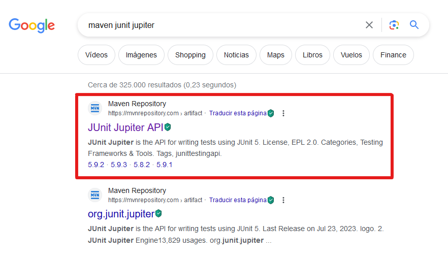

# Tutorial Conexión JPA en IntelliJ Idea Community Editions

En este tutorial revisaremos cómo establecer una **conexión con una base de datos desde IntelliJ Idea Community Editions haciendo uso de Maven, EclipseLink y JPA** (API de persistencia de Java, por sus siglas en inglés). Actualmente no hay casi información acerca de cómo realizar este proceso manualmente en la versión gratuita del IDE previamente mencionado, por lo que espero que este documento sea de ayuda para quienes lo necesiten.

## Creando nuestro proyecto

En primer lugar, tendremos que crear nuestro proyecto. Para ello iremos a File > New > Project (véase la figura 1), si tenemos abierto ya un proyecto, o a New Project (véase la figura 2), si estamos en la página de inicio de IntelliJ Idea.

<p align="center">
  <br>
  <strong>Figura 1.</strong> Creación de proyecto en IntelliJ Idea Community Edition cuando se tiene abierto otro proyecto.
</p>

<p align="center">
  <br>
  <strong>Figura 2.</strong> Creación de proyecto en IntelliJ Idea Community Edition cuando se está en la página de inicio.
</p>

En la ventana emergente, asignaremos un nombre a nuestro proyecto y escogeremos la ruta en la que lo guardaremos. Posteriormente, elegiremos «Java» como lenguaje (*language*), «Maven» como herramienta de construcción (*build system*) y seleccionaremos la versión 17 de Java (véase la figura 3). En las opciones avanzadas, podremos también asignar un valor al identificador del equipo (*groupId*),  elemento que señala la organización o grupo que creó el proyecto. La estructura que debe seguir este ítem es: «com.[nombre del responsable del proyecto].[nombre del proyecto]». En este caso, utilizaré mi nombre de usuario de Github para el nombre del responsable, así que quedará de la siguiente manera: com.lenzdz.libraryApp. No es necesario que modifiquemos el identificar del artefacto (*artifactId*), que vendría siendo el mismo nombre del proyecto. Una vez hayamos terminado, haremos clic en el botón «Create».

<p align="center">
  <br>
  <strong>Figura 3.</strong> Selección de opciones en menú de creación de proyecto.
</p>

## Añadiendo las dependencias necesarias

Cuando se haya terminado de crear nuestro proyecto, tendremos que agregar las dependencias que usaremos mediante el archivo «pom.xml», el cual está ubicado en la carpeta raíz. El archivo POM (modelo de objetos de proyecto, por sus siglas en inglés) es la unidad fundamental de trabajo en Maven. Contiene información sobre el proyecto y los detalles de configuración utilizados por Maven para construirlo. Para este ejercicio, añadiremos las últimas versiones a la fecha de las dependencias correspondientes a JUnit, JPA y el controlador de MySQL.

Inicialmente, nuestro archivo POM debería verse de la siguiente manera:
```xml
  <?xml version="1.0" encoding="UTF-8"?>
  <project xmlns="http://maven.apache.org/POM/4.0.0"
           xmlns:xsi="http://www.w3.org/2001/XMLSchema-instance"
           xsi:schemaLocation="http://maven.apache.org/POM/4.0.0 http://maven.apache.org/xsd/maven-4.0.0.xsd">
      <modelVersion>4.0.0</modelVersion>
  
      <groupId>com.lenzdz.libraryApp</groupId>
      <artifactId>Library</artifactId>
      <version>1.0-SNAPSHOT</version>
  
      <properties>
          <maven.compiler.source>17</maven.compiler.source>
          <maven.compiler.target>17</maven.compiler.target>
          <project.build.sourceEncoding>UTF-8</project.build.sourceEncoding>
      </properties>
  
  </project>
```

Tras abrir el documento, buscaremos en nuestro navegador «Maven JUnit» y haremos clic en la página correspondiente al repositorio oficial de Maven (véase la figura 4). 

<p align="center">
  <br>
  <strong>Figura 4.</strong> Búsqueda de JUnit para Maven en el navegador.
</p>

Estando allí, seleccionaremos la versión de JUnit que deseamos emplear (figura 5) y copiaremos el código que se encuentra en la pestaña «Maven» para agregar la dependencia a nuestro proyecto (figura 6).

<p align="center">
  <br>
  <strong>Figura 5.</strong> Selección de la última versión de JUnit a la fecha en el repositorio de Maven.
</p>

<p align="center">
  <br>
  <strong>Figura 6.</strong> Copia del código para añadir la dependencia a nuestro proyecto.
</p>


Regresaremos a nuestro documento POM en IntelliJ Idea y agregaremos la etiqueta ```<dependencies>```. Luego, adentro de esta, pegaremos el código que copiamos del repositorio. Repetiremos el proceso anterior para las dependencias adicionales que deseemos agregar, siendo aquellas en este caso el JPA de EclipseLink y el conector de MySQL. 

<details><summary>Si quieres verificar cómo es el proceso para añadir estas últimas dos dependencias, haz clic aquí.</summary><br>

Para añadir la implementación de JPA con EclipseLink, buscaremos en nuestro navegador «Maven JPA EclipseLink», seleccionaremos la versión que queramos utilizar de la lista y copiaremos el código asociado para incluir la dependencia en nuestro proyecto (véase la figura 7).

<p align="center">
  <br>
  <strong>Figura 7.</strong> Búsqueda y selección de dependencia JPA por EclipseLink.
</p>

</details>

Eventualmente tendremos el siguiente POM.
```xml
<?xml version="1.0" encoding="UTF-8"?>
<project xmlns="http://maven.apache.org/POM/4.0.0"
         xmlns:xsi="http://www.w3.org/2001/XMLSchema-instance"
         xsi:schemaLocation="http://maven.apache.org/POM/4.0.0 http://maven.apache.org/xsd/maven-4.0.0.xsd">
    <modelVersion>4.0.0</modelVersion>

    <groupId>com.lenzdz.libraryApp</groupId>
    <artifactId>Library</artifactId>
    <version>1.0-SNAPSHOT</version>

    <properties>
        <maven.compiler.source>17</maven.compiler.source>
        <maven.compiler.target>17</maven.compiler.target>
        <project.build.sourceEncoding>UTF-8</project.build.sourceEncoding>
    </properties>

    <dependencies>
        <dependency>
            <groupId>junit</groupId>
            <artifactId>junit</artifactId>
            <version>4.13.2</version>
            <scope>test</scope>
        </dependency>
    </dependencies>

</project>
```

